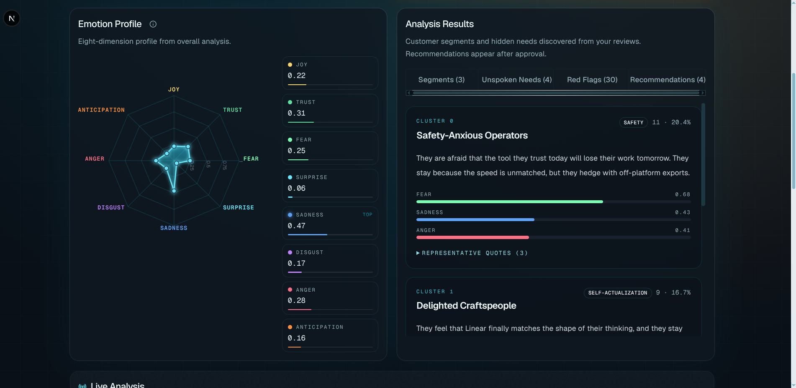
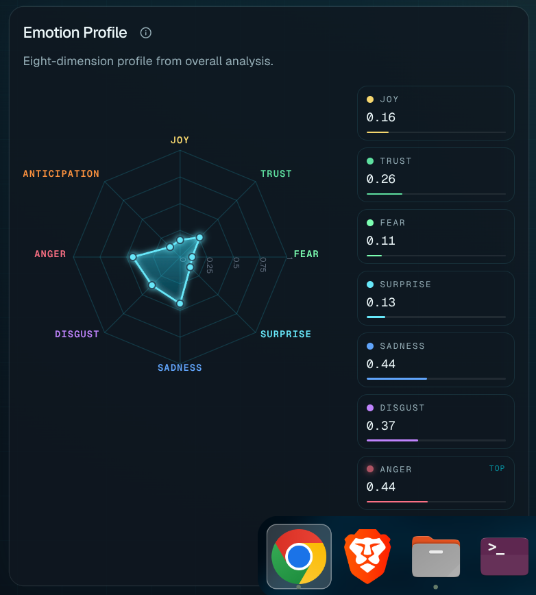
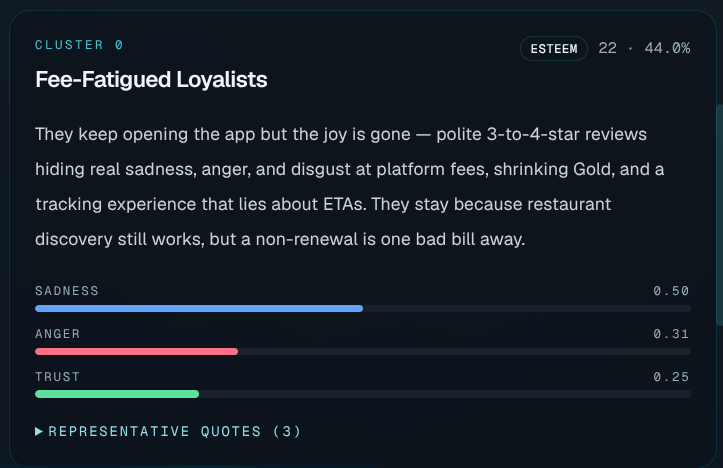
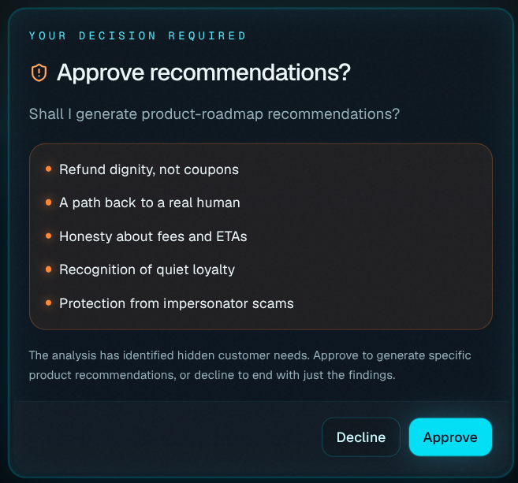
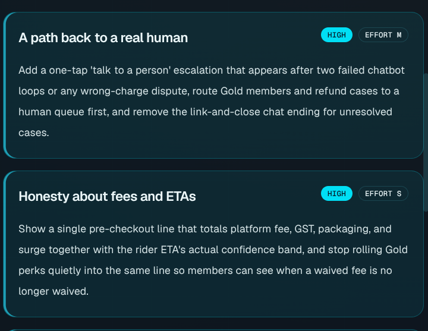
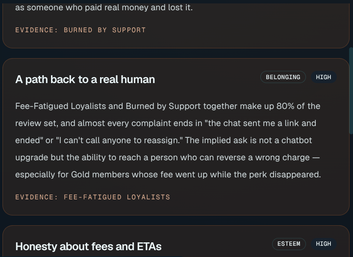
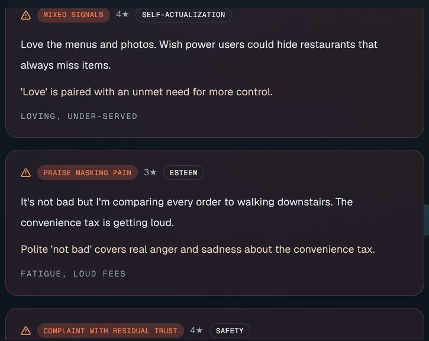
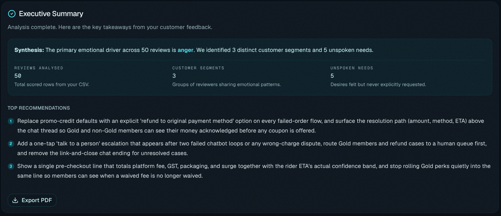
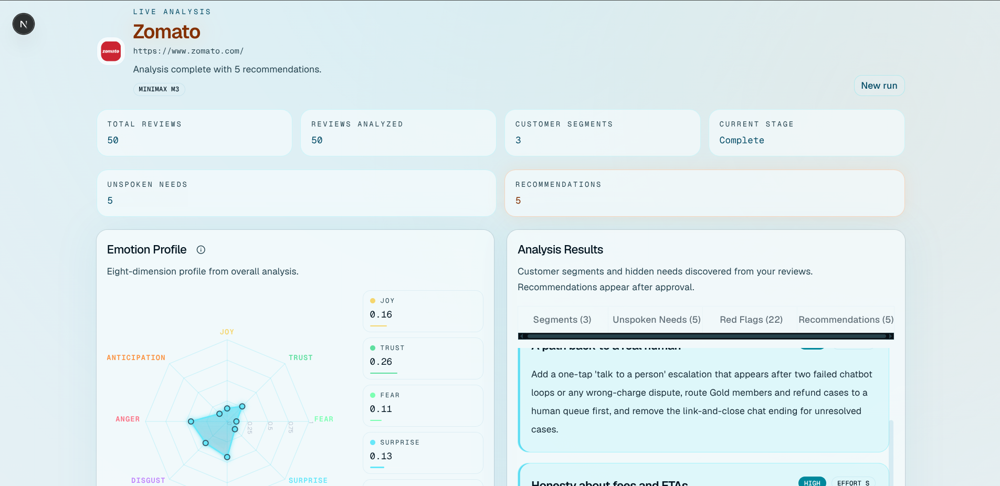

# Resonance

> **Customer emotion archaeology powered by Plutchik's Wheel**

[](https://github.com/kernelKain/resonance/actions/workflows/ci.yml)
[](LICENSE)

Resonance does not classify reviews as positive, negative, or neutral. It scores each review on Plutchik's eight emotions, flags cognitive dissonance, maps an unmet Maslow need, clusters the emotion vectors in a TrueForge sandbox, names psychological archetypes, writes Hidden Asks — then **pauses for a human** before any product-roadmap recommendation is emitted.

Built for [The Agent Harness Hackathon](https://wemakedevs.org/) on the TrueForge harness (filesystem MCP, Exa web search, Daytona sandbox, `ask_user_question`).

---

## Screenshots

<p align="center">
  
</p>

<p align="center">
  
  &nbsp;
  
</p>

<p align="center">
  
  &nbsp;
  
</p>

<p align="center">
  
  &nbsp;
  
</p>

<p align="center">
  
  &nbsp;
  
</p>

Upload a CSV → watch the Plutchik wheel fill in real time → approve the analysis → export a dark-theme PDF.

More captures, input CSVs, and PDFs: [`demo_data/Results/`](demo_data/Results/).

---

## Sample analyses

| Product | Dataset | Report |
| --- | --- | --- |
| Linear | [`hero_reviews.csv`](demo_data/Results/Linear/hero_reviews.csv) | [PDF](demo_data/Results/Linear/linear-resonance-report.pdf) |
| Zomato | [`zomato_reviews.csv`](demo_data/Results/Zomato/zomato_reviews.csv) | [PDF](demo_data/Results/Zomato/zomato-resonance-report.pdf) |
| Cursor Origin | [`origin_reviews.csv`](demo_data/Results/Cursor/origin_reviews.csv) | [PDF](demo_data/Results/Cursor/cursor-resonance-report.pdf) |

Click **Load demo dataset** in the UI to run the Linear sample without preparing a file.

---

## Harness usage

What judges should look for — Resonance uses the TrueForge capabilities instead of collapsing them into a single LLM call.

| Capability | What Resonance does with it |
| --- | --- |
| **Filesystem MCP** | Reads the uploaded CSV by basename; writes `scored_reviews.json`, `cluster_results.json`, `full_analysis.json`, `action_items.json`. |
| **Exa web search** | A subagent researches the product so “I love it” is interpreted in category context. |
| **Daytona sandbox** | `scripts/cluster.py` (k-means, silhouette-selected k in 3–5) runs **inside** the sandbox. The laptop filesystem is not visible to Daytona. |
| **`ask_user_question`** | HITL interrupt after Hidden Asks. Roadmap `action_items` are emitted only after **Approved**. |
| **Dynamic subagents** | Product research is delegated; scoring, clustering, and the approval gate stay on the root agent. |

---

## How it works

1. Drop a CSV of customer reviews (`review_text` required; `rating`, `date`, `author` optional).
2. The TrueForge agent `resonance` reads the file through a local filesystem MCP (basename only).
3. A subagent researches the product with Exa so "I love it" is interpreted in category context.
4. Every row is scored: 8-D Plutchik vector, dissonance type, one Maslow need.
5. `scripts/cluster.py` runs **inside the Daytona sandbox** (k-means, silhouette-selected k in 3–5). The laptop filesystem is not visible to Daytona; the agent copies the script and JSON into the sandbox itself.
6. The model names one archetype per cluster and 3–5 Hidden Asks (`action_items` is JSON `null` at this stage).
7. TrueForge interrupts with `ask_user_question` (`Approved` / `Decline`).
8. Only after **Approved** does it emit roadmap `action_items`.

The Next.js UI on port **43123** streams those `resonance-data` fences into a Plutchik radar, segment cards, dissonance alerts, and an approval modal.

---

## Psychological frameworks

### Plutchik's eight emotions

Each review gets eight independent floats in `[0.0, 1.0]`: joy, trust, fear, surprise, sadness, disgust, anger, anticipation.

Politeness is not joy. `"Fine, I guess. It works."` on a 4-star rating is low joy, some trust, elevated sadness. Star rating is a weak prior only.

### Cognitive dissonance

Literal words and the emotion profile can disagree. `dissonance.type` is exactly one of:

| Type | Meaning |
| --- | --- |
| `positive_words_negative_emotions` | Affirming language while sadness / anger / fear dominate. |
| `negative_words_positive_emotions` | Complaint sitting on residual trust or joy. |
| `mixed_signals` | The review argues with itself ("I love it but I probably won't renew"). |
| `none` | Words and affect agree. |

### Maslow (unmet need)

One primary unmet need per review. Physiological is out of scope.

| Need | Typical tell |
| --- | --- |
| `safety` | Outages, crashes, export-as-backup, permissions panic. |
| `belonging` | Lonely onboarding, empty assignee, no one to ask a naive question. |
| `esteem` | Years of loyalty ignored, 4-star "fine", power users unseen. |
| `self_actualization` | "I wish it did more", frozen roadmap, mastery ceiling. |

A Hidden Ask is the need the pattern implies that **no review filed as a ticket**. Roadmap language is forbidden there. Recommendations wait for the human.

---

## Architecture

Three processes. Do not collapse them.

```text
Browser  :43123  Next.js UI (upload, SSE parse, radar, HITL modal)
                |  /api/upload  /api/session  /api/turn  /api/health
                v
TrueForge :8790  Agent "resonance"  (OpenRouter model, HITL, subagents)
                |-- remote MCP filesystem  :8792  uploads/, demo_data/, analysis/, scripts/
                |-- remote MCP Exa         https://mcp.exa.ai/mcp
                +-- Daytona sandbox        /home/trueforge/  (cluster.py + sklearn)
```

---

## Deploy (VM, nothing local)

Oracle Always Free ARM VM + Docker Compose + Cloudflare Tunnel. TrueForge and the filesystem MCP stay on loopback; only the UI is published.

Copy-paste runbook, Compose file, and systemd units: **[`deploy/README.md`](deploy/README.md)**.

```bash
curl -fsSL https://raw.githubusercontent.com/kernelKain/resonance/main/deploy/install-vm.sh | sudo bash
sudo nano /opt/resonance/.env    # OPENROUTER_API_KEY, DAYTONA_API_KEY
sudo systemctl start resonance-compose
```

---

## Setup

### Prerequisites

- **Node.js** ≥ 20
- **Python** ≥ 3.10 (for `scripts/cluster.py` validation only; execution happens in the Daytona sandbox)
- A running **TrueForge** instance at `http://127.0.0.1:8790` with the `resonance` agent loaded
- A running **TrueForge filesystem MCP** at `http://127.0.0.1:8792`

### 1. Clone and install

```bash
git clone https://github.com/kernelKain/resonance.git
cd resonance
npm install
```

### 2. Configure environment

```bash
cp .env.example .env.local
```

Edit `.env.local` and fill in:

| Variable | Required | Description |
| --- | --- | --- |
| `OPENROUTER_API_KEY` | ✅ | Your OpenRouter API key — used by TrueForge for the agent model |
| `DAYTONA_API_KEY` | ✅ | Daytona API key for sandbox execution |
| `TRUEFORGE_BASE_URL` | optional | Default: `http://127.0.0.1:8790` |
| `TRUEFORGE_AGENT_NAME` | optional | Default: `resonance` |
| `TRUEFORGE_MODEL` | optional | Default: `openrouter/minimax-minimax-m-3-free` |
| `TRUEFORGE_FALLBACK_AGENT_NAME` | optional | Default: `resonance-deepseek` |
| `TRUEFORGE_FALLBACK_MODEL` | optional | Default: `openrouter/deepseek-deepseek-v4-flash-0731` |
| `MODEL_COOLDOWN_MS` | optional | MiniMax recovery-probe cooldown; default: `300000` |
| `UPLOAD_TTL_MS` | optional | Uploaded CSV retention; default: `86400000` (24 hours) |
| `MCP_URL` | optional | Default: `http://127.0.0.1:8792/mcp` |
| `TRUEFORGE_SANDBOX_EXEC_TIMEOUT_MS` | optional | Default: `300000` (5 min — needed for pip + sklearn install) |

### 3. Start the UI and filesystem service

```bash
npm run resonance
```

Open [http://localhost:43123](http://localhost:43123).

Use `npm run dev` when you only need the Next.js UI.

### 4. Start TrueForge

Follow the TrueForge documentation to start the harness with the `resonance` agent configuration from `agent.json`. Then register the agent:

```bash
npm run harness
npm run bootstrap
```

---

## Usage

1. **Enter a product name or URL** in the upload card — this gives the Exa subagent context.
2. **Upload a CSV** with at least a `review_text` column (UTF-8, any line endings), or click **Load demo dataset**.
3. Watch the **Live Analysis** stepper — each stage shows a contextual hint explaining what the AI is doing.
4. When the agent reaches **Approval**, review the archetypes and Hidden Asks in the panel.
5. Click **Approve** (or **Decline** to abort). Recommendations are only generated after Approve.
6. Use **Export PDF** to download the complete dark-theme report.

No reviews of your own? Use **Copy CSV generator prompt**, paste it into ChatGPT with a product URL, and upload the CSV it returns.

### Keyboard shortcut

| Key | Action |
| --- | --- |
| `Ctrl + D` | Toggle Developer mode — raw agent output, health dots, and fixture replays |

The **Dev** button in the header provides the same toggle for mouse users. Fixture replays work even when TrueForge is not connected, so you can walk the UI without API keys.

### Model continuity

MiniMax M3 is the primary model. If a new analysis receives a quota, rate-limit,
capacity, or retryable provider error before streaming starts, Resonance
transparently replays that first turn on DeepSeek V4 Flash 0731. The DeepSeek
fallback has a one-million-token context window and supports structured output
and tool calling. A run remains pinned to one model through its approval
checkpoint. After the configured cooldown, a new run probes MiniMax and closes
the circuit after a successful turn.

---

## CSV format

```csv
review_text,rating,date,author
"Great product, works as expected.",5,2024-01-15,Alice
"Fine I guess. It works but support was slow.",3,2024-01-16,Bob
```

- `review_text` — **required**, the full review body
- `rating` — optional integer 1–5
- `date` — optional ISO date
- `author` — optional display name
- Uploads are capped at **50 concise reviews** per run (short rows preferred). Extra rows are dropped.

A sample dataset ships at `public/demo/hero_reviews.csv`. Click **Load demo dataset** on the upload card to try it without your own data.

---

## Project structure

```text
resonance/
├── app/                    # Next.js App Router
│   ├── api/                # upload, session, turn, health, product metadata
│   ├── globals.css
│   └── layout.tsx
├── components/             # Workbench UI (radar, insights, HITL modal, PDF)
├── hooks/                  # Session, SSE stream, health polling
├── lib/                    # Stream parser, Plutchik utils, CSV, model router
├── mcp/filesystem/         # Local filesystem MCP for uploads/ and demo_data/
├── schemas/                # JSON contracts for each resonance-data fence
├── scripts/
│   └── cluster.py          # k-means clustering (runs in Daytona sandbox)
├── demo_data/Results/      # Linear, Zomato, Cursor demo CSVs, screenshots, PDFs
├── public/demo/            # Sample CSVs and stream fixtures for the UI
├── deploy/                 # Oracle VM runbook, systemd units, install script
├── docker-compose.yml      # UI + MCP + TrueForge (+ optional Cloudflare Tunnel)
├── agent.json              # TrueForge agent configuration (do not commit secrets)
└── .env.example
```

---

## Development

```bash
npm run lint
npm run typecheck
npm test
```

---

## Acknowledgements

- [TrueForge](https://trueforge.dev) — agent harness with HITL, MCP, and Daytona sandboxing
- [Robert Plutchik](https://en.wikipedia.org/wiki/Plutchik%27s_wheel_of_emotions) — the emotion taxonomy
- [OpenRouter](https://openrouter.ai) — model routing
- [Exa](https://exa.ai) — semantic web search MCP

---

## License

MIT
